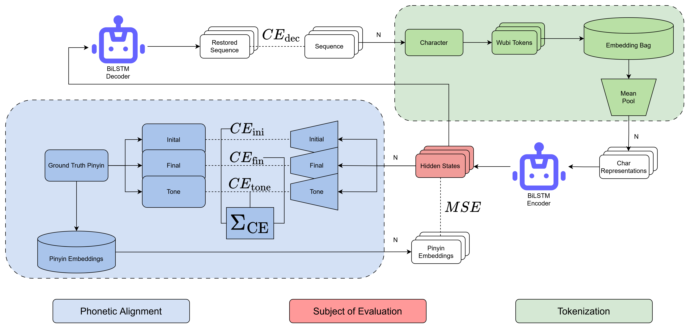
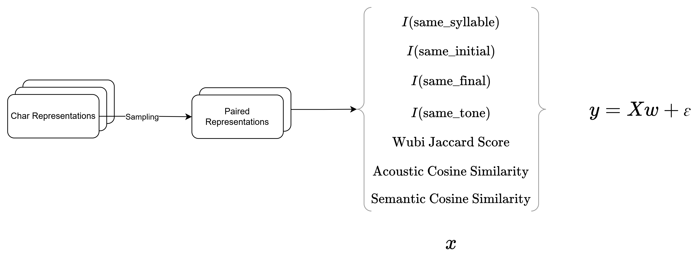
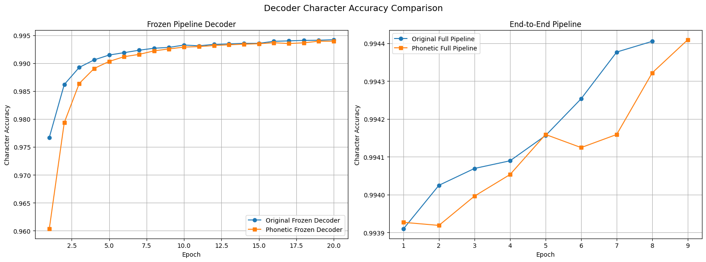
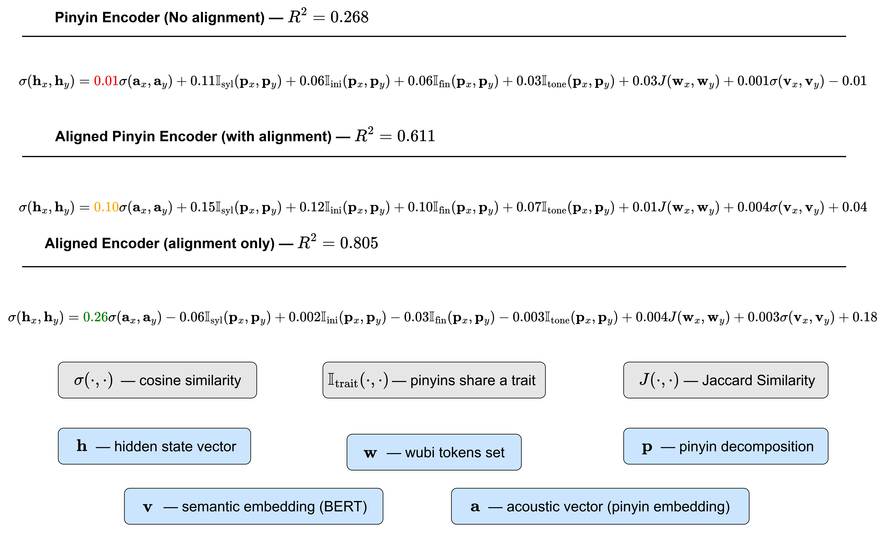

# Mandarin Phonetics Modeling

> Shaping and probing the **hidden representation space** of Mandarin encoders through **acoustic alignment**.

## Key Findings

- **Pinyin prediction alone does not yield a phonetically organized space.** Hidden-space similarity is driven mainly by discrete pinyin categories and, for the BiLSTM, by visual Wubi overlap.
- **Acoustic alignment reshapes the geometry.** Adding a continuous acoustic target raises the explanatory power of acoustic similarity from $R^2 = 0.268$ (pinyin encoder) to $0.611$ (pinyin-aligned) and $0.805$ (aligned), after PCA.
- **Alignment compresses the manifold.** The number of principal components needed to explain 90% of the variance drops from **497 → 332 → 67** across the three objectives.
- **The geometry shows up behaviorally.** As alignment strengthens, decoders recover the original lexical item instead of copying a perturbed homophone (recovery $0.018 \rightarrow 0.654$ for LSTM).
- **The effect is architecture-independent.** The same trend reproduces with BERT encoders despite their different inductive bias, confirming it comes from the alignment objective rather than the architecture.

## Motivation

> In many representation learning tasks, the objective is not only to distinguish between classes but to organize the **hidden representation space** according to a desired notion of similarity, such as phonetic, semantic, or visual relatedness. We study this problem through Mandarin phonetic representation learning by comparing three encoder objectives: a **pinyin encoder** trained for phonetic prediction, a **pinyin-aligned encoder** jointly optimized for pinyin prediction and **acoustic alignment**, and an **aligned encoder** trained solely to match continuous acoustic embeddings. Across both BiLSTM and BERT architectures, we investigate three complementary strategies for shaping hidden representations: **a shared sub-character input basis** (Wubi decomposition), **a continuous acoustic target space** derived from wav2vec2 speech embeddings, and **dimensionality reduction** to reveal latent structure. To explain the resulting representations, we introduce a probing framework that combines interpretable regression analysis with a homophone reconstruction benchmark, allowing us to disentangle the contributions of visual, phonetic, acoustic, and semantic factors to hidden-space organization.

## Training Pipeline

### Pipeline objectives

The three encoders differ only in how the encoder is supervised, controlled by the **acoustic alignment** term (MSE against wav2vec2 embeddings):

$$
\mathcal{L}_{\text{pinyin}}=\text{CE}_{\text{dec}} + \mathbb{\lambda}_{\text{enc}} \Sigma_{\text{CE}}
$$

$$
\mathcal{L}_{\text{pinyin-aligned}}=\text{CE}_{\text{dec}} + \mathbb{\lambda}_{\text{enc}} (\Sigma_{\text{CE}} + \mathbb{\lambda}_{\text{MSE}} \text{MSE})
$$

$$
\mathcal{L}_{\text{aligned}}=\text{CE}_{\text{dec}} + \mathbb{\lambda}_{\text{enc}} \text{MSE}
$$

## Evaluation Method

## Results

The results follow one storyline: **acoustic alignment** first perturbs the optimization, then reshapes the **hidden representation space**, and finally changes how decoders behave when probed.

### 1. Optimization dynamics

Introducing **acoustic alignment** into the encoder objective measurably perturbs decoder training, costing **-1.64% after the first epoch**. This is the first sign that the alignment pressure is competing with the pinyin objective rather than simply riding along with it.

### 2. Hidden geometry

Regression analysis explains hidden-space similarity in terms of visual, phonetic, acoustic, and semantic factors. As **acoustic alignment** strengthens, acoustic similarity becomes the dominant explanatory factor and the **hidden representation space** collapses into a progressively lower-dimensional manifold:

| Objective | Acoustic $R^2$ (post-PCA) | PCs for 90% variance |
| :-------- | ------------------------: | -------------------: |
| Pinyin encoder | 0.268 | 497 |
| Pinyin-aligned encoder | 0.611 | 332 |
| Aligned encoder | **0.805** | **67** |

Full coefficient tables, EDA, and SHAP interpretability results are available in this [multi-page diagram](https://viewer.diagrams.net/?tags=%7B%7D&lightbox=1&highlight=0000ff&edit=_blank&layers=1&nav=1&title=Regression.drawio&dark=auto#Uhttps%3A%2F%2Fdrive.google.com%2Fuc%3Fid%3D1W-LC8AjJy-AxZTbzUfHF3dNrhw-hKX1Z%26export%3Ddownload).

### 3. Probing

The geometric change is confirmed behaviorally. Each perturbed homophone bigram is passed through an encoder and reconstructed by its decoder; a high **recovery** rate means the hidden state discarded character identity and kept only phonetic information, while a high **copy** rate means it preserved character identity. The representative LSTM target-position outcome:

| Metric       | Pinyin Encoder | Pinyin-Aligned Encoder | Aligned Encoder |
| :----------- | -------------: | ---------------------: | --------------: |
| **Recovery** |          0.018 |                  0.042 |       **0.654** |
| **Copy**     |          0.768 |                  0.725 |       **0.077** |

As alignment strengthens, recovery rises and copying collapses — hidden states progressively fold character-specific information into shared phonetic representations. The same qualitative trend reproduces with BERT encoders (recovery $0.081 \rightarrow 0.434$), confirming the effect is driven by the objective, not the architecture. Comprehensive phrase-level and BERT tables are reported in the paper.

## Conclusion

We find that optimizing an encoder only for pinyin prediction does not naturally produce a **hidden representation space** organized by phonetic similarity. Instead, hidden-state similarity is primarily explained by discrete pinyin categories and, for the BiLSTM encoder, by visual Wubi overlap. Introducing explicit **acoustic alignment** with continuous embeddings fundamentally changes this geometry: the **pinyin-aligned encoder** substantially increases the explanatory power of acoustic similarity, while the **aligned encoder** makes it the dominant factor, increasing the regression fit from **$R^2=0.268$** for the pinyin encoder to **$0.611$** and **$0.805$**, respectively, after PCA. Alignment also concentrates the representations into progressively lower-dimensional manifolds, reducing the number of principal components required to explain 90% of the variance from **497** to **332** and finally **67**.

These structural changes are reflected behaviorally in the homophone probing benchmark. As alignment strengthens, decoders become increasingly likely to recover the original lexical item rather than copying the perturbed homophone, indicating that hidden states progressively collapse character-specific information into shared phonetic representations. The same qualitative trend is reproduced with BERT encoders, despite their substantially different inductive bias, demonstrating that the effect arises from the alignment objective rather than the encoder architecture. Overall, the study shows that explicit continuous supervision can reshape neural representations from discrete symbolic categories toward graded similarity spaces, providing a practical framework for both learning and interpreting structured latent representations beyond Mandarin phonetics.

## Notebooks Structure

In the repository we provide the final versions of the notebooks that are loaded from Kaggle. These notebooks provide the results but are not supposed to be run outside of the Kaggle environment. Nevertheless, the results of running are still visible.

### Tokenization
- [wubi-tokenizer.ipynb](notebooks/Tokenization/wubi-tokenizer.ipynb): Notebook for Wubi tokenization implementation and testing.

### Datasets

#### Pinyin Embeddings
- [mandarin-sounds-dataset.ipynb](notebooks/Datasets/Pinyin%20Embeddings/mandarin-sounds-dataset.ipynb): Main notebook for creating and processing the Mandarin sounds dataset (using the finetuned Wav2Vec model). The sounds are loaded from the [pinyin chart](https://studycli.org/pinyin-chart/) provided by StudyCLI website.
- [evaluation-of-mandarin-sounds-dataset-base.ipynb](notebooks/Datasets/Pinyin%20Embeddings/evaluation-of-mandarin-sounds-dataset-base.ipynb): Notebook for evaluating the Mandarin sounds dataset using embeddings from the base Wav2Vec model.
- [evaluation-of-mandarin-sounds-dataset-zh-ch.ipynb](notebooks/Datasets/Pinyin%20Embeddings/evaluation-of-mandarin-sounds-dataset-zh-ch.ipynb): Notebook for evaluating the Mandarin sounds dataset using embeddings from the finetuned Wav2Vec model.

#### Pinyin Labeling
- [char2pinyin-pinyin2char-framework.ipynb](notebooks/Datasets/Pinyin%20Labeling/char2pinyin-pinyin2char-framework.ipynb): Notebook for training a character-to-pinyin model on a different corpus. The corpus is not primarily chosen for modeling due to unknown domain and too broad vocabulary. However, the general pinyin labeling is sufficient with this corpus.
- [pinyin-dataset-labelling.ipynb](notebooks/Datasets/Pinyin%20Labeling/pinyin-dataset-labelling.ipynb): Notebook for labeling the [main pinyin dataset](https://huggingface.co/datasets/AIxBlock/Chinese-short-sentences) using a pre-trained character-to-pinyin model.
- [pinyin-eval-dataset-labelling.ipynb](notebooks/Datasets/Pinyin%20Labeling/pinyin-eval-dataset-labelling.ipynb): Notebook for labeling the Pinyin evaluation dataset.

#### Probing
- [exact-homophones.ipynb](notebooks/Datasets/Probing/exact-homophones.ipynb): Notebook for sampling characters sharing exact pinyin (homophones) from the corpus with counting and filtering with minimal frequency threshold.
- [phrase-perturbation.ipynb](notebooks/Datasets/Probing/phrase-perturbation.ipynb): Notebook for collecting frequent bigrams (word-level parsing `jieba`) and random perturbation of character with a homophone substitute. A perturbed pair itself should infrequent in corpus to evaluate direct copy rate caused by character identity leakage.

### Training

#### Pinyin Encoder (LSTM)
- [wubi-tokenizer-mandarin-encoder.ipynb](notebooks/Training/LSTM/Pinyin%20Model/wubi-tokenizer-mandarin-encoder.ipynb): Training of Mandarin encoder with Wubi tokenizer using pinyin objective.
- [wubi-tokenizer-mandarin-frozen-pipeline.ipynb](notebooks/Training/LSTM/Pinyin%20Model/wubi-tokenizer-mandarin-frozen-pipeline.ipynb): Frozen encoder training pipeline (decoder is trained only).
- [wubi-tokenizer-mandarin-full-pipeline.ipynb](notebooks/Training/LSTM/Pinyin%20Model/wubi-tokenizer-mandarin-full-pipeline.ipynb): Complete training pipeline for Mandarin encoder with Wubi tokenizer.
- [wubi-tokenizer-scratch-pipeline.ipynb](notebooks/Training/LSTM/Pinyin%20Model/wubi-tokenizer-scratch-pipeline.ipynb): Training pipeline for Wubi tokenizer from scratch (both encoder and decoder).

#### Pinyin Aligned Encoder (LSTM)
- [phonetic-aware-representaions-learning.ipynb](notebooks/Training/LSTM/Pinyin%20Aligned%20Model/phonetic-aware-representaions-learning.ipynb): Training of Mandarin encoder with Wubi tokenizer and acoustic alignment. Note that the link refers to the Kaggle version of the encoder with a stable training, for unstable version view "Version 2".
- [phonetic-aware-frozen-pipeline.ipynb](notebooks/Training/LSTM/Pinyin%20Aligned%20Model/phonetic-aware-frozen-pipeline.ipynb): Frozen encoder training pipeline (decoder is trained only).
- [phonetic-aware-frozen-pipeline-unstable-encoder.ipynb](notebooks/Training/LSTM/Pinyin%20Aligned%20Model/phonetic-aware-frozen-pipeline-unstable-encoder.ipynb): Frozen encoder training pipeline (decoder is trained only, training of encoder was not stable due to small alignment pressure). This notebook is used for contrasting the effect of proper alignment.
- [phonetic-aware-full-pipeline.ipynb](notebooks/Training/LSTM/Pinyin%20Aligned%20Model/phonetic-aware-full-pipeline.ipynb): Complete training pipeline for phonetic-aware encoder (decoder and stable trained encoder).

#### Aligned Encoder (LSTM)
- [pure-phonetic-encoder.ipynb](notebooks/Training/LSTM/Aligned%20Model/pure-phonetic-encoder.ipynb): Training of Mandarin encoder with Wubi tokenizer using alignment only.
- [pure-phonetic-frozen-pipeline.ipynb](notebooks/Training/LSTM/Aligned%20Model/pure-phonetic-frozen-pipeline.ipynb): Frozen encoder training pipeline (decoder is trained only).
- [pure-phonetic-full-pipeline.ipynb](notebooks/Training/LSTM/Aligned%20Model/pure-phonetic-full-pipeline.ipynb): Complete training pipeline for Mandarin encoder with Wubi tokenizer.

#### Pinyin Encoder (BERT)
- [pinyin-bert-encoder.ipynb](notebooks/Training/BERT/Pinyin%20Model/pinyin-bert-encoder.ipynb): Training of Mandarin encoder based on BERT using pinyin objective only.
- [frozen-pinyin-bert-decoder-pipeline.ipynb](notebooks/Training/BERT/Pinyin%20Model/frozen-pinyin-bert-decoder-pipeline.ipynb): Frozen encoder training pipeline (decoder is trained only).

#### Pinyin Aligned Encoder (BERT)
- [pinyin-aligned-bert-encoder.ipynb](notebooks/Training/BERT/Pinyin%20Aligned%20Model/pinyin-aligned-bert-encoder.ipynb): Training of Mandarin encoder based on BERT using alignment and pinyin objective.
- [frozen-pinyin-aligned-bert-decoder-pipeline.ipynb](notebooks/Training/BERT/Pinyin%20Aligned%20Model/frozen-pinyin-aligned-bert-decoder-pipeline.ipynb): Frozen encoder training pipeline (decoder is trained only).

#### Aligned Encoder (BERT)
- [aligned-bert-encoder.ipynb](notebooks/Training/BERT/Aligned%20Model/aligned-bert-encoder.ipynb): Training of Mandarin encoder based on BERT using alignment only.
- [frozen-aligned-bert-decoder-pipeline.ipynb](notebooks/Training/BERT/Aligned%20Model/frozen-aligned-bert-decoder-pipeline.ipynb): Frozen encoder training pipeline (decoder is trained only).

### Extracting Representations
Extraction of context-averaged and context-aware representations for phonetic similarity analysis. Each notebook provides the data about characters in a given sentence from the evaluation corpus: hidden state, pinyin embedding, semantic embedding (BERT), decomposed pinyin, and Wubi tokens.

#### LSTM Models
- [pinyin-lstm-representations.ipynb](notebooks/Representations%20Extraction/LSTM/pinyin-lstm-representations.ipynb): representations of pinyin encoder.
- [pinyin-aligned-lstm-representations.ipynb](notebooks/Representations%20Extraction/LSTM/pinyin-aligned-lstm-representations.ipynb): representations of pinyin-aligned encoder.
- [aligned-lstm-representations.ipynb](notebooks/Representations%20Extraction/LSTM/aligned-lstm-representations.ipynb): representations of aligned encoder.

#### BERT Models
- [pinyin-bert-representations.ipynb](notebooks/Representations%20Extraction/BERT/pinyin-bert-representations.ipynb): representations of pinyin encoder.
- [pinyin-aligned-bert-representations.ipynb](notebooks/Representations%20Extraction/BERT/pinyin-aligned-bert-representations.ipynb): representations of pinyin-aligned encoder.
- [aligned-bert-representations.ipynb](notebooks/Representations%20Extraction/BERT/aligned-bert-representations.ipynb): representations of aligned encoder.

### Regression Analysis

#### LSTM Models
- [lstm-pinyin-encoder-analysis.ipynb](notebooks/Regression%20Analysis/LSTM/lstm-pinyin-encoder-analysis.ipynb): analysis of pinyin encoder.
- [lstm-pinyin-aligned-encoder-analysis.ipynb](notebooks/Regression%20Analysis/LSTM/lstm-pinyin-aligned-encoder-analysis.ipynb): analysis of pinyin-aligned encoder.
- [lstm-aligned-encoder-analysis.ipynb](notebooks/Regression%20Analysis/LSTM/lstm-aligned-encoder-analysis.ipynb): analysis of aligned encoder.

#### BERT Models
- [bert-pinyin-encoder-analysis.ipynb](notebooks/Regression%20Analysis/BERT/bert-pinyin-encoder-analysis.ipynb): analysis of pinyin encoder.
- [bert-pinyin-aligned-encoder-analysis.ipynb](notebooks/Regression%20Analysis/BERT/bert-pinyin-aligned-encoder-analysis.ipynb): analysis of pinyin-aligned encoder.
- [bert-aligned-encoder-analysis.ipynb](notebooks/Regression%20Analysis/BERT/bert-aligned-encoder-analysis.ipynb): analysis of aligned encoder.

### Probing
Evaluation of trained decoders on the probing dataset. Each perturbed bigram is passed through the respective encoder, and the hidden states of the encoder are fed into the respective decoder that predicts a probable output (greedy, top-k). The result is compared with the input to identify the copy and restore rates.

#### LSTM Models
- [pinyin-lstm-decoder-benchmarking.ipynb](notebooks/Probing/LSTM/pinyin-lstm-decoder-benchmarking.ipynb): results of pinyin pipeline.
- [pinyin-aligned-lstm-decoder-benchmarking.ipynb](notebooks/Probing/LSTM/pinyin-aligned-lstm-decoder-benchmarking.ipynb): results of pinyin-aligned pipeline.
- [aligned-lstm-decoder-benchmarking.ipynb](notebooks/Probing/LSTM/aligned-lstm-decoder-benchmarking.ipynb): results of aligned pipeline.

#### BERT Models
- [pinyin-bert-decoder-benchmarking.ipynb](notebooks/Probing/BERT/pinyin-bert-decoder-benchmarking.ipynb): results of pinyin pipeline.
- [pinyin-aligned-bert-decoder-benchmarking.ipynb](notebooks/Probing/BERT/pinyin-aligned-bert-decoder-benchmarking.ipynb): results of pinyin-aligned pipeline.
- [aligned-bert-decoder-benchmarking.ipynb](notebooks/Probing/BERT/aligned-bert-decoder-benchmarking.ipynb): results of aligned pipeline.
